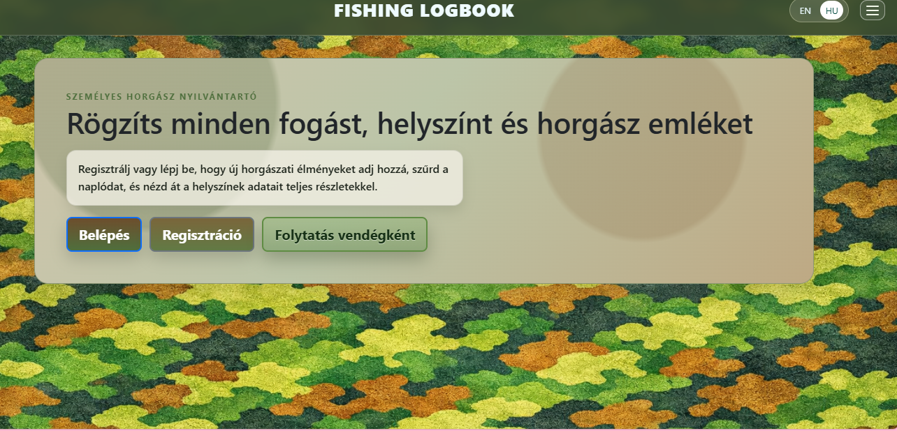
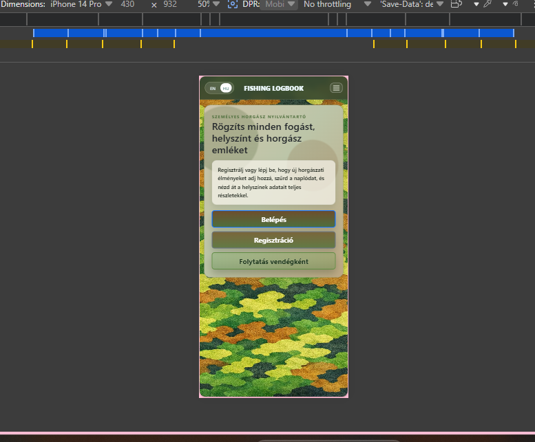

# Fishing Logbook

A multi-page fishing logbook web app built with HTML, CSS, and JavaScript. The app helps users log fishing catches, organize them by location, and track their sessions with built-in authentication and responsive design.

## 1. Strategy Plane

### Project Overview

This project is a multi-page fishing logbook web application created using HTML, CSS, and Vanilla JavaScript. The application helps users log and organize their fishing catches with a clean, easy-to-use interface designed for outdoor use.

The goal of this project is to create a practical tool for fishers to keep track of their sessions, catches, and locations in one place, while practicing modern front-end development with responsive design and state management using localStorage and optional Firebase integration.

### Purpose, Value and Deployment

#### Purpose of the Application

The purpose of this web application is to provide a clean, accessible, and easy-to-use platform for logging fishing sessions. It helps users avoid scattered notes across photos, messages, or paper by keeping everything in one readable flow: sign in, log a catch, review it later, and check where fishing sessions happened.

The app is designed to be practical for outdoor use, with a responsive layout that works on mobile devices and strong contrast that is easy to read in bright sunlight. The interface prioritizes the most common tasks to make them fast and simple.

#### Value to Users

The website provides value by offering users:

- A quick and organized way to log fish catches with multiple fish per session
- Ability to organize catches by location and date
- Language switching between English and Hungarian
- Guest mode for quick access without registration
- Optional Firebase integration for cloud backup
- Responsive design that works on desktop, tablet, and mobile devices

Potential users include recreational fishers who want to keep records, competitive fishers tracking statistics, and outdoor enthusiasts documenting their trips.

#### Deployment

The project is deployed using GitHub Pages or Firebase Hosting.

**GitHub Pages Steps:**

1. Push the project to a GitHub repository
2. Open repository settings
3. Navigate to the "Pages" section
4. Under Source, select the main branch
5. Click Save to publish the site

**Firebase Hosting Steps:**

1. Install Firebase CLI
2. Run `firebase login`
3. Run `firebase init hosting` and follow prompts
4. Run `firebase deploy`

### User Stories

#### User Experience Prioritisation

### Must Have

- As a fisher, I want to quickly log a catch with date and location so I can record it while still on the water.
- As a fisher, I want to access the app without registration (guest mode) so I can start logging immediately.
- As a returning user, I want to see all my catches organized by date so I can review my fishing history.
- As a mobile user, I want the interface to be usable on my phone so I can log catches outdoors.
- As a multilingual user, I want to switch between English and Hungarian so I can use the app in my preferred language.

### Should Have

- As a fisher, I want to organize catches by location so I can see where I've been most successful.
- As a fisher, I want to log multiple fish in one session so I can record all details.
- As a fisher, I want to filter catches by date or location so I can find specific sessions easily.
- As a returning user, I want the navigation to be consistent across all pages so I can move between sections without thinking.
- As a recruiter viewing this code, I want to see clean, organized code so I can assess development skills.

### Could Have

- As a fisher, I want to upload photos of my catches so I can remember what they looked like.
- As a fisher, I want to export my catch history as CSV or PDF so I can share or print records.
- As a fisher, I want to see charts showing my catch trends so I can analyze my fishing patterns.

---

## 2. Scope Plane

### Functional Requirements

- User authentication (registration, login, guest mode)
- Password reset with email or code verification
- Dashboard navigation with hamburger menu
- Add catch form with multiple fish rows per session
- Catch details view showing all logged information
- Logbook list with filtering by date and location
- Places grouping view showing all catches by location
- Language switching (English/Hungarian)
- Data storage with localStorage fallback and optional Firebase integration
- Image upload for catch documentation

### Non-Functional Requirements

- Clean, readable layout that works outdoors in bright conditions
- Fast loading and responsive performance
- Mobile-first responsive design
- Consistent navigation across all pages
- Accessible color contrast and readable fonts
- Data privacy with client-side storage by default
- Optional cloud backup with Firebase

### MVP (Minimum Viable Product)

The MVP includes these essential features for a complete fishing logbook:

| Feature | Description | Priority |
| --- | --- | --- |
| User authentication | Registration, login, and guest mode all work | MVP (essential) |
| Dashboard | User can navigate to all app sections | MVP (essential) |
| Add catch form | User can log a catch with multiple fish | MVP (essential) |
| Logbook list | All catches are displayed and filterable | MVP (essential) |
| Catch details | Full information about each catch is visible | MVP (essential) |
| Places view | Catches are grouped by location | MVP (essential) |
| Responsive layout | App works on mobile, tablet, and desktop | MVP (essential) |
| Language switching | EN/HU language toggle is available | MVP (essential) |

### Feature Prioritisation Table

| Feature | Description | Priority |
| --- | --- | --- |
| User registration and login | Complete auth flow with password reset | MVP (essential) |
| Add catch form | Save fish catches with date and location | MVP (essential) |
| Logbook list and filters | View all catches with sorting options | MVP (essential) |
| Dashboard navigation | Access all app sections easily | MVP (essential) |
| Responsive mobile layout | Works on phones and tablets | MVP (essential) |
| Language switching (EN/HU) | Toggle between English and Hungarian | MVP (essential) |
| Place grouping | View catches organized by location | MVP (essential) |
| Catch details page | Full view of individual catch data | MVP (essential) |
| Image upload | Add photos to catch records | Add later |
| Export to CSV/PDF | Download catch history | Add later |
| Analytics charts | Visualize catch trends | Add later |
| Offline draft saving | Save catches without connection | Add later |

---

## 3. Scope Plane (continued)

### Project Structure

#### index.html — Landing Page

The main entry point of the application. It includes:

- Welcome message and project overview
- Navigation to login, register, or guest mode
- Quick action buttons for primary user flows
- Responsive layout with hamburger menu

#### login.html — User Login

User authentication page with features:

- Email and password login form
- Clear error messages (invalid email format, email not found, wrong password)
- Password reset flow with code generation or email
- Option to create new account or continue as guest

#### register.html — User Registration

New user account creation with fields:

- Username (minimum 3 characters)
- Email address
- Password
- Terms acceptance checkbox
- Validation for all required fields

#### dashboard.html — User Dashboard

Central navigation hub after login with:

- User welcome message
- Navigation cards to all app features
- Quick access buttons
- Logout option
- Language switcher

#### add-catch.html — Add Catch Form

Comprehensive catch entry form with:

- Date picker
- Location/place name input
- Maps link (optional)
- Fish count and multiple fish rows
- Per-fish fields: type, weight (kg/lb)
- Weather and water temperature notes
- Optional notes and comments
- Image upload capability
- Save and cancel actions

#### my-catches.html — Logbook List

Logbook view with filtering and display:

- Filter options (by date range, location, fish type)
- List view of all catches
- Catch count badge
- Click to view catch details
- Sort options (newest first, by location, by weight)

#### catch-details.html — Catch Details

Individual catch view showing:

- All catch information
- Weather and temperature recorded
- All fish logged in that session
- Location and maps link
- Photos if uploaded
- Edit and delete options

#### places.html — Places Aggregation

Location-based view with:

- All locations where user has fished
- Number of catches per location
- Total weight per location
- Recent catches at each place
- Click to filter logbook by place

### Data Model and Storage

**Local Storage Keys:**

- `flb_users` - Registered user accounts
- `flb_current_user` - Currently logged-in user info
- `flb_catches` - All catch entries
- `flb_language` - User language preference (EN/HU)
- `flb_reset_codes` - Password reset codes and expiry times

**Storage Notes:**

- Guest data is isolated by guest user ID
- If Firebase is available and user is authenticated, data can sync to cloud
- If Firebase is unavailable, app falls back to localStorage behavior
- Password reset codes expire after 10 minutes
- All data stored locally remains on the user's device by default

---

## 4. Skeleton Plane

### Layout and Responsiveness

**Flexbox Layout:**

- Main content uses flexbox for flexible, responsive arrangement
- Navigation menu uses flexbox for alignment
- Forms use flexbox for clean stacking

**Mobile-First Design:**

- Navigation buttons and menu work on all screen sizes
- Bootstrap buttons remain clear and easy to tap on mobile
- Images scale correctly to screen size
- Text remains readable on all devices
- Form inputs have adequate spacing for touch interaction
- Hamburger menu accessible on all device sizes

**Responsive Behavior:**

- Topbar stays compact, keeping main content visible
- Hamburger menu opens as right-aligned dropdown (not full-screen)
- Menu dropdown width follows content length
- EN/HU language switch always accessible
- Form actions remain prominent on mobile screens

### Testing

#### Manual Testing

Tested the following critical user journeys:

| Feature | Expected Result | Actual Result | Pass |
| ----- | ----- | ---- | ----- |
| User registration | New account created successfully | Works as expected | Yes |
| User login | Valid credentials log user in | Works as expected | Yes |
| Guest mode | Continue without login | Works as expected | Yes |
| Add catch | Catch saved to logbook | Works as expected | Yes |
| View logbook | All catches displayed with filters | Works as expected | Yes |
| View catch details | Full catch information displayed | Works as expected | Yes |
| Filter by location | Logbook filtered correctly | Works as expected | Yes |
| Filter by date | Catches filtered by date range | Works as expected | Yes |
| Navigation menu | All menu items work correctly | Works as expected | Yes |
| Language switch | EN/HU toggle works | Works as expected | Yes |
| Responsive mobile | Layout stacks and adapts | Works as expected | Yes |
| Image upload | Photos save with catch | Works as expected | Yes |
| Password reset | Reset code/email flow works | Works as expected | Yes |
| Hamburger menu | Opens, closes, and aligns correctly | Works as expected | Yes |

#### Device Testing

Tested on:

- Desktop computer (1920x1080)
- Tablet (iPad-sized screens)
- Mobile phone (360px-480px width)
- Various browsers: Chrome, Firefox, Safari

### Screenshots

**Laptop View:**

**Responsive Mobile View:**

---

## 5. Surface Plane

### Visual Design

**Design Philosophy:**

- Clean, minimalistic layout optimized for outdoor readability
- Strong contrast for visibility in bright sunlight
- Practical first, decorative second
- Form actions use stronger contrast for easy spotting
- Logbook and place views structured for scanning, not dense reading

### Colors and Fonts

**Color Palette:**

- Primary brand color: `#4f6f3d` (forest green, earthy)
- Secondary: `#a5342f` (rust/danger red for alerts)
- Text: Dark gray/black for readability
- Buttons: Bootstrap primary (blue) with custom overrides
- Backgrounds: White and light gray for readability
- Accent: Blue for interactive elements

**Typography:**

- Primary font: System sans-serif stack (Arial, Helvetica, sans-serif)
- Headings: Bold weights for visual hierarchy
- Body text: Regular weight, comfortable line spacing
- Forms: Clear labels and placeholder text
- Button text: Readable size, high contrast

**Favicon:**

- Custom favicon created from project assets

### Technologies Used

- **HTML5** - Semantic markup and form structure
- **CSS3** - Layout, responsive design, custom properties
- **Flexbox** - Primary layout mechanism
- **Bootstrap 4** - Button styling, modal dialogs, responsive utilities
- **Vanilla JavaScript** - Form handling, state management, DOM manipulation
- **Firebase SDK** (optional) - Cloud auth and storage with localStorage fallback
- **Google Fonts** (optional) - Typography enhancements
- **Web Storage API** - localStorage for client-side data persistence

### Validator Testing

#### HTML Validation

Tested using W3C HTML Validator — no critical errors found.

**Current Status:** Valid HTML5

#### CSS Validation

Tested using W3C CSS Validator — no errors found.

**Current Status:** Valid CSS3

#### JavaScript Validation

Code reviewed for:

- Proper variable scoping
- Error handling in auth flows
- Correct Firebase integration
- Fallback to localStorage when offline

**Current Status:** No console errors on load

### Browser Compatibility

Tested and working on:

- Chrome 90+
- Firefox 88+
- Safari 14+
- Edge 90+

### Run Locally

1. Clone or download the project
2. Open `index.html` in a browser
3. Register a new account, login, or continue as guest
4. Use dashboard cards or the hamburger menu to navigate
5. Add catches and explore the logbook

### Deploy

This project can be deployed as a static site. The two most practical options are GitHub Pages and Firebase Hosting.

#### Before You Deploy

1. Make sure the app runs locally without console errors
2. Check that image paths are correct, especially `assets/images/background.png` and screenshots
3. Confirm that `assets/js/app.js` contains the Firebase config you want to ship
4. Verify that login, register, and password reset pages still work
5. Test all main user flows on mobile and desktop
6. Commit all changes so the deployment source is clean

#### Option 1: GitHub Pages

1. Push the project to a GitHub repository
2. Open the repository on GitHub
3. Go to `Settings`
4. Open `Pages`
5. Under `Build and deployment`, select `Deploy from a branch`
6. Choose the `main` branch
7. Set the folder to `/(root)`
8. Save the settings
9. Wait for GitHub Pages to finish building
10. Open the published URL that GitHub provides
11. Test the home page, login, register, and responsive hamburger menu

#### Option 2: Firebase Hosting

1. Install Firebase CLI if you do not have it yet
2. Run `firebase login` in your terminal
3. From the project root, run `firebase init hosting`
4. Choose the Firebase project that matches your config in `assets/js/app.js`
5. Set the public directory to `.` so root HTML files are served correctly
6. Answer `No` when asked if this is a single-page app
7. If asked to overwrite files, do not overwrite existing app files
8. Run `firebase deploy`
9. Copy the hosting URL from the terminal output
10. Open the deployed site and test registration, login, guest mode, and catch entry saving

#### After Deployment

1. Verify that screenshots load correctly in the README
2. Test the mobile layout, especially the hamburger menu and language switch
3. Confirm that the login and password reset flows work correctly
4. If Firebase is enabled, confirm that auth and storage behave as expected
5. Check all navigation links work on the live site

### Security Note

This is a client-side project/prototype. Do not use plain local password storage in production. For a production app, implement:

- Secure backend authentication
- Password hashing and salting
- HTTPS only
- Secure token storage
- Rate limiting on login attempts

"Must Have"

- Add backend validation and secure auth flow
- Add automated tests for filtering and catch rendering
- Implement proper password hashing

"Should Have"

- Add server-side image rules and quotas
- Add export features (CSV/PDF)
- Add better analytics per place and fish type

"Could Have"

- Add optional weather history API integration
- Add social sharing features
- Add richer charts for catch trends
- Add offline-friendly draft saving
- Add a printable catch summary page
- Add species database with photos
- Add weather predictions for locations

---

## Manual Testing Table

Use this table to check the important user journeys after changes or before deployment.

| Area | Test | Expected Result | Status |
| --- | --- | --- | --- |
| Home page | Open the landing page on desktop | Hero text is readable, main actions are visible, no layout break | To test |
| Home page | Open the landing page on phone | Content stacks correctly, buttons stay usable, menu still works | To test |
| Login | Enter a valid email and password | User logs in and reaches the dashboard | To test |
| Login | Enter a wrong password | Clear error message is shown | To test |
| Login | Enter an invalid email format | Clear email format error is shown | To test |
| Register | Register with username, email, and password | Account is created and user is redirected | To test |
| Reset flow | Request a reset code or email | Reset message is shown and the flow is usable | To test |
| Add catch | Save a catch with at least one fish row | Catch is stored and appears in the logbook | To test |
| Logbook | Apply filters | Results update correctly and the count badge changes | To test |
| Places | Open a place entry | All logs for that place are grouped correctly | To test |
| Responsive nav | Open and close the hamburger menu | Menu stays right aligned and closes correctly | To test |

Thanks for visiting my Fishing Logbook Project
